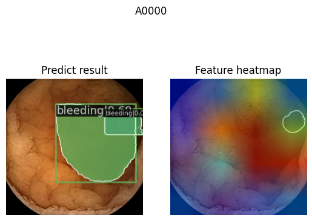

# Auto-WCEBleedGen-Challenge-Version-V2

## 1.Environment

Run the prepare.sh to auto create the virtual environment for classification and instance segmentation:

```bash
bash -i prepare_env.sh
```

> ⚠️ Since the environment of classification and instance segmentation will be installed separate, the `i` in ``bash -i prepare_env.sh`` is necessary.

If the following information appears, means the both environments installation are successful.

```bash
Processing dependencies for DCNv3==1.0
Finished processing dependencies for DCNv3==1.0
```

### 1.1 Classification

Download the testing classification data from [here](https://drive.google.com/drive/folders/1MBT-x7fFPIWLCLSX0INQAqOtNL8J2CAa?usp=sharing).
Unzip the classification_data.zip and classification_weight.zip, moving them into classification folder.

```bash
YOUR_PATH\AUTO-WCEBLEEDGEN-CHALLENGE-VERSION-V2\CLASSIFICATION
├───config
│   ├───efficientnet
│   └───_base_
│       ├───datasets
│       │   └───pipelines
│       ├───models
│       └───schedules
├───data <- *From classificaiton_data.zip*
│   └───WCEBleedGen_v2
│       ├───test1
│       │   ├───bleeding
│       │   └───non-bleeding
│       ├───test2
│       │   ├───bleeding
│       │   └───non-bleeding
│       ├───train
│       │   ├───bleeding
│       │   └───non-bleeding
│       └───val
│           ├───bleeding
│           └───non-bleeding
├───datasets
│   └───pipelines
├───tools
└───weight <- *From classificaiton_weight.zip*
```

### 1.2 Instance segmentation

Download the testing instance segmentation data from [here](https://drive.google.com/drive/folders/1CYz6MMGqIOIKq9rU6c-PO_Fe3onjdCgB?usp=sharing).
Unzip the instance_segmentation_data.zip and instance_segmentation_weight.zip, moving them into instance_segmentation folder.

```bash
C:\USERS\USER\DESKTOP\AUTO-WCEBLEEDGEN-CHALLENGE-VERSION-V2\INSTANCE_SEGMENTATION
├───configs
│   ├───coco
│   └───_base_
│       ├───datasets
│       ├───models
│       └───schedules
├───data <- *From instance_segmentation_data.zip*
│   └───WCEBleedGen_v2
│       ├───instance_seg_img_test1
│       │   ├───Annotations
│       │   ├───coco_annotation
│       │   ├───Images
│       │   └───Labels
│       └───instance_seg_img_test2
│           ├───Annotations
│           ├───coco_annotation
│           ├───Images
│           └───Labels
├───mmcv_custom
│   └───__pycache__
├───mmdet_custom
│   ├───datasets
│   │   └───__pycache__
│   ├───models
│   │   ├───backbones
│   │   │   └───__pycache__
│   │   ├───dense_heads
│   │   │   └───__pycache__
│   │   ├───detectors
│   │   │   └───__pycache__
│   │   ├───utils
│   │   │   └───__pycache__
│   │   └───__pycache__
│   └───__pycache__
├───ops_dcnv3
│   ├───build
│   │   ├───bdist.linux-x86_64
│   │   ├───lib.linux-x86_64-3.9
│   │   │   ├───functions
│   │   │   └───modules
│   │   └───temp.linux-x86_64-3.9
│   │       └───ssd8
│   │           └───van
│   │               └───InternImage
│   │                   └───detection
│   │                       └───ops_dcnv3
│   │                           └───src
│   │                               ├───cpu
│   │                               └───cuda
│   ├───DCNv3.egg-info
│   ├───dist
│   ├───functions
│   │   └───__pycache__
│   ├───modules
│   │   └───__pycache__
│   └───src
│       ├───cpu
│       └───cuda
├───tools
└───weight <- *From instance_segmentation_weight.zip*
```

## 2. Inference

Use the following command to inference, classification and instance segmentation will be done at the same time.

```bash
bash -i inference.sh
```

Once completed, you can find the classificaiton results in `classification/work_dirs/test1_efficientnet-b7_8xb32_in1k_WCE`, `classification/work_dirs/test2_efficientnet-b7_8xb32_in1k_WCE`, the metrics value can find in `{timestamp}/{timestamp}.json`.

Also, you can find the visualize image results in `classification/work_dirs/test1_efficientnet-b7_8xb32_in1k_WCE/vis_images` and `classification/work_dirs/test2_efficientnet-b7_8xb32_in1k_WCE/vis_images`.

Similarly, in `instance_segmentation` folder, you can find the visualize results in work_dirs: `instance_segmentation/work_dirs/test1_internimage_xl` and bounding box, segmentation mask json result in `instance_segmentation/work_dirs/test1_internimage_xl/mask_and_bbox_results`.

## 3. Calculate the metrics of instance segmentation
> ⚠️Before run the following command, you need to activate the `WCE_instance_seg` environment first: `conda activate WCE_instance_seg`

You can use following command to calculate the ensemble result metrics of instance segmentation:

```bash
python instance_segmentation/calculate_instance_seg_metrics.py --result_json [predict bbox or segm json file] --GT_json [ground truth of bbox or segm json file]
```

If not specific `--result_json` and `--GT_json` parameters, default will use
`--result_json=instance_segmentation/ensemble_results/test1_affirmative.bbox.json`
and
`--GT_json=instance_segmentation/data/WCEBleedGen_v2/instance_seg_img_test1/coco_annotation/anno_test1.json`
to calculate the ensemble results.

## 4. CAM
> ⚠️Before run the following command, you need to activate the `WCE_instance_seg` environment first: `conda activate WCE_instance_seg`

You can use following command to show the CAM(class activation mapping):
```bash
python instance_segmentation/CAM_neck_avg_channel.py
```
You can use `--img` to specific one single image or whole image folder, default is `instance_segmentation/data/WCEBleedGen_v2/instance_seg_img_test1/Images`, or can use `--save_path` to setting the save path, default is `internimage_xl_CAM_results`.

Nonetheless, you can also use `--combine` to combine the CAM image and bbox, instance segmentation result.
